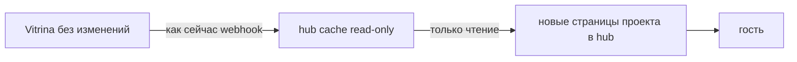

# 09 — Тематические страницы проектов (hub.sites)

> **Инвариант:** Vitrina **не трогаем**. Тенанты, хабы `/h/*`, страницы `/p/*`, booking, inbox, sync — как были.  
> **Новое:** дополнительные публичные страницы-проекты в mega-hub. Они **читают** карточки из кэша, ничего из Vitrina не переносят и не заменяют.  
> kendala.tourhub.kz и TourHub/OTA — только примеры внешнего вида, не рантайм.

Канон кода: [docs/sites/](../sites/README.md).

mega-hub уже **насадка** над Vitrina: туда попадают тенанты из кэша, там живёт market, который может объединять продукты разных тенантов или быть витриной одного, если микросайта `/h/*` недостаточно. Страницы проектов — **ещё одна такая насадка**, не перенос Vitrina.

## Что добавляем

В конструкторе mega-hub собирается **страница проекта**:

1. На холст ставятся **карточки уже существующих тенантов** (один или несколько) — live из `hub.company_cache` / `listing_cache`.
2. Рядом можно писать **свои материалы** проекта: описание, блог, FAQ — это не страница тенанта в Vitrina.
3. Скин (`operator` / `destination`) чуть меняет вид, структура — блоки.
4. **Ассистент** помогает ориентироваться: базовые знания + знания этой страницы + карточки на ней.

## Что не делаем

Это **не перенос продукта**. Экосистема как была:

| Слой | Где | Меняем? |
|------|-----|---------|
| Тенанты, Tenant Hub `/h/*`, страницы `/p/*`, booking, inbox, sync | **vitrina** | **нет** |
| Cache `company_cache` / `listing_cache` | mega-hub | только **чтение** |
| Новые страницы проекта | mega-hub `/admin/sites` и `/s/{slug}` | **только это новое** |
| TourHub / OTA | tourhub | не участвует |

- Не меняем код и модель Vitrina (`hub_nodes`, `pages`, booking, tenant settings).
- Не переносим Tenant Hub в mega-hub.
- Не подменяем `/h/*` и `/p/*`.
- Не привязываем эти страницы к приложению TourHub.

## Конструктор

`https://hub.microp.app/admin/sites/{slug}/builder`

Блоки: `hero`, `info`, `tenant_cards`, `listing_cards`, `posts`, `gallery`, `faq`, `cta`.

Прототип: [templates/constructor.html](../sites/templates/constructor.html).

## Публичный URL страницы проекта

`https://hub.microp.app/s/{slug}`  
Опционально свой домен → тот же `/s/{slug}` в mega-hub.

Ассистент: `POST /api/sites/{slug}/assistant`.

## Scope карточек

AND по непустым: `tenant_ids`, `theme_slugs`, `country_codes`, `city_codes`.

## Куда писать код, когда начнут реализацию

Только **добавления** в mega-hub (`sibnike/hub`). Код vitrina не править.  
DDL `hub.sites*` зеркалируется в `vitrina/supabase/migrations/` **только** потому что prod push схемы уже идёт оттуда — это не изменение приложения Vitrina.
