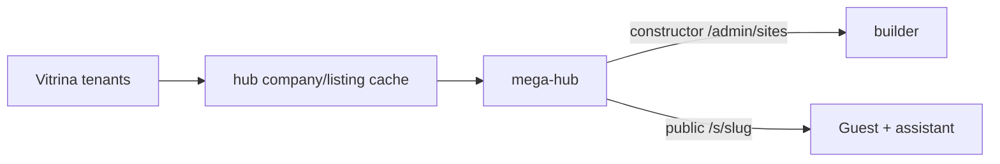

# 09 — Тематические сайты (hub.sites)

> **Решение:** 2026-09-09  
> **Где живёт продукт:** целиком в **mega-hub** — конструктор, публичный сайт, ассистент.  
> **TourHub / www.ota.kz и kendala.tourhub.kz — только примеры** чужих витрин, не рантайм этого продукта.

Канон кода: [docs/sites/](../sites/README.md).

## Идея

Один проект = сайт на mega-hub. На холсте:

1. **Карточки тенанта или нескольких тенантов** — блоки `tenant_cards` / `listing_cards` из `hub.company_cache` / `listing_cache` (Vitrina — источник истины).
2. **Свои материалы** — описания, журнал, FAQ. Пишутся в конструкторе, это не карточка тенанта.
3. **Стиль** — пакет `operator` / `destination`, без нового приложения.
4. **Ассистент-менеджер** — базовые знания платформы + знания этого сайта + холст и карточки.

## Не путать

| Слой | Что | Приложение |
|------|------|------------|
| Tenant Hub | плитки одного тенанта (пример: kendala.tourhub.kz) | **vitrina** `/h/*` |
| B2B `/m` | guided-search для тенантов, login | mega-hub |
| TourHub / OTA | отдельный маркет, **не используется здесь** | tourhub |
| **hub.sites** | проект: карточки + материалы + ассистент | **mega-hub** `/admin/sites` и `/s/{slug}` |

## Конструктор

`https://hub.microp.app/admin/sites/{slug}/builder`

Блоки: `hero`, `info`, `tenant_cards`, `listing_cards`, `posts`, `gallery`, `faq`, `cta`.

Прототип: [templates/constructor.html](../sites/templates/constructor.html).

## Публичный сайт

Фаза 1: `https://hub.microp.app/s/{slug}`  
Фаза 2: `{subdomain}.microp.app` или `custom_domain` → rewrite на `/s/{slug}` **в mega-hub**, раньше чем B2B `/m`.

Ассистент: `POST /api/sites/{slug}/assistant` на том же хосте. Anthropic остаётся в mega-hub.

## Scope карточек

AND по непустым: `tenant_ids`, `theme_slugs`, `country_codes`, `city_codes`.  
`marketplace_slug` — необязательный доп. фильтр канала, **не** привязка к приложению TourHub.

## Куда класть код

Только **sibnike/hub**. См. [APPLY.md](../sites/APPLY.md).
