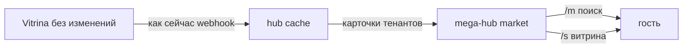

# 09 — Публичные страницы market в mega-hub

> **Инвариант:** Vitrina **не трогаем**. Тенанты, микросайт `/h/*`, страницы `/p/*`, booking, inbox, sync — как были.  
> **Уже есть:** mega-hub — отдельная **насадка**. Туда размещаются тенанты из Vitrina (кэш). Там живёт **market**.  
> kendala.tourhub.kz и TourHub/OTA — примеры вида микросайта / B2C, не рантайм этой насадки.

Канон кода: [docs/sites/](../sites/README.md).

## Что уже зафиксировано

mega-hub не заменяет Vitrina. Это слой поверх:

```
Vitrina (тенант, микросайт /h, страницы /p, booking)
    → webhook → hub cache
        → mega-hub market (насадка)
```

**Market** в mega-hub уже умеет:

- **объединять продукты разных тенантов**, или
- быть **продуктом одного тенанта**, если микросайта `/h/*` недостаточно.

Конструктор страниц — не новый продукт и не перенос Vitrina. Это **публичная витрина того же market**: свои тексты, блог, FAQ, ассистент рядом с живыми карточками из кэша.

| Нужно | Где |
|-------|-----|
| Микросайт тенанта | Vitrina `/h/*` — **не трогаем** |
| Один тенант, микросайта мало | mega-hub market, скин `operator` |
| Несколько тенантов вместе | mega-hub market, скин `destination` |
| B2B поиск и заявки | уже `/m/{slug}` в том же mega-hub |
| Витрина с материалами + ассистент | конструктор той же насадки (`/s/{slug}`) |



## Что добавляем в эту насадку

На холсте market:

1. **Карточки тенантов** (один или несколько) — live из `hub.company_cache` / `listing_cache`.
2. **Свои материалы** витрины: описание, блог, FAQ — это не `/p/*` тенанта.
3. Скин `operator` / `destination` чуть меняет вид.
4. **Ассистент** по этой витрине: знания платформы + знания этой страницы + карточки.

Черновик UI: `/admin/sites/{slug}/builder`, публично `/s/{slug}`.

Блоки: `hero`, `info`, `stats`, `steps`, `tenant_cards`, `listing_cards`, `manual_cards`, `team`, `posts`, `gallery`, `reviews`, `faq`, `map`, `contacts`, `partners`, `video`, `pricing`, `join`, `cta`.

Владелец маркета настраивает страницу сам, карточки тенантов подтягиваются. Кто владелец, как тенанты просят размещение и как это продаётся — [10-market-placement.md](./10-market-placement.md). Демо на двух тенантах Каракола — [../sites/DEMO-KARAKOL.md](../sites/DEMO-KARAKOL.md).

## Что не делаем

- Не меняем код и модель Vitrina (`hub_nodes`, `pages`, booking, tenant settings).
- Не переносим микросайт `/h/*` в mega-hub.
- Не подменяем `/p/*`.
- Не выносим это в TourHub.

## Scope карточек

AND по непустым: `tenant_ids`, `theme_slugs`, `country_codes`, `city_codes`.  
`marketplace_slug` — тот же канал `hub.marketplaces`, не отдельный продукт.

## Куда писать код, когда начнут реализацию

Только **добавления** в mega-hub (`sibnike/hub`). Код vitrina не править.  
Таблицы `hub.sites*` — контент витрины **внутри** насадки market, не новая схема `public`.
