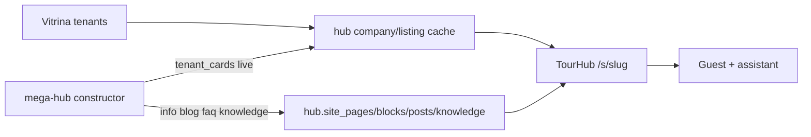

# 09 — Тематические сайты (hub.sites)

> **Решение:** 2026-09-09, уточнение: конструктор + ассистент  
> **Срез:** проект собирается в **конструкторе mega-hub**. Карточки тенантов — живые. Блоги, описания и прочие материалы — свои. Стиль — пакет (`operator` / `destination`).  
> **Рендер:** TourHub `/s/{slug}`. **Не** `/m/*` и **не** Tenant Hub `/h/*`.

Канон кода: [docs/sites/](../sites/README.md).

## Идея

Один проект = сайт. На холсте:

1. **Карточки тенанта или нескольких тенантов** — блок `tenant_cards` / `listing_cards`, данные из `hub.company_cache` / `listing_cache` (Vitrina остаётся источником истины).
2. **Свои материалы** — описания, журнал, FAQ, галерея. Это уже не тенант, а контент проекта.
3. **Стиль** чуть меняется пакетом, а не новым форком.
4. **Ассистент-менеджер** помогает ориентироваться: базовые знания платформы + знания этого сайта + то, что лежит на холсте и в карточках.

Так собирается множество проектов без клона TourHub.

## Не путать

| Слой | Что | Где правится |
|------|-------|----------------|
| Tenant Hub | плитки одного тенанта | vitrina `/h/*` |
| B2B `/m` | guided-search для тенантов | mega-hub, login |
| **hub.sites** | публичный проект | конструктор mega-hub `/admin/sites/{slug}/builder` |

## Конструктор (mega-hub)

Админ: `/admin/sites/{slug}/builder`

Блоки:

| type | Данные |
|------|--------|
| `hero` | брендинг проекта |
| `info` | свой текст |
| `tenant_cards` | live компании (scope или явные id) |
| `listing_cards` | live услуги |
| `posts` | журнал проекта |
| `gallery` / `faq` / `cta` | свои материалы |

Страницы: `home`, плюс любые (`journal`, about, …).  
Журнал: `hub.site_posts`. Публично `/s/{slug}/journal/{post}`.

Прототип холста: [templates/constructor.html](../sites/templates/constructor.html).

## Scope карточек

AND по непустым полям `hub.sites`: `tenant_ids`, `theme_slugs`, `country_codes`, `city_codes`, опционально `marketplace_slug`.

Один тенант → бренд-сайт. Несколько / гео / тема → витрина направления.

## Стиль

`sites.template` = **скин**, не структура:

- `operator` — тёмный editorial
- `destination` — светлый DMO

Холст один и тот же (блоки). Меняется оболочка.

## Ассистент

Роль: менеджер сайта. Находит карточку, услугу, статью; объясняет как забронировать.

Два слоя знаний:

1. **Базовые** — `hub.assistant_base_knowledge` (роль, карточки, бронь). Одинаковы для всех проектов, правит platform admin.
2. **Этого сайта** — `hub.site_knowledge` + страницы/блоки/посты + текущие карточки тенантов.

API: `POST /api/sites/{slug}/assistant` `{ message }` → `{ reply, links[] }`.  
TourHub проксирует `/api/sites/{slug}/assistant`, ключ Anthropic остаётся в mega-hub.

Знания сайта **не** отдаются публичным GET — только service_role ассистенту.

## Хостинг

Фаза 1: `https://www.ota.kz/s/{slug}`  
Фаза 2: `{slug}.ota.kz` / custom_domain → TourHub, не mega-hub.

## Куда класть код

См. [APPLY.md](../sites/APPLY.md). Миграции: `20260909000000` (sites) + `20260909120000` (builder/knowledge).
